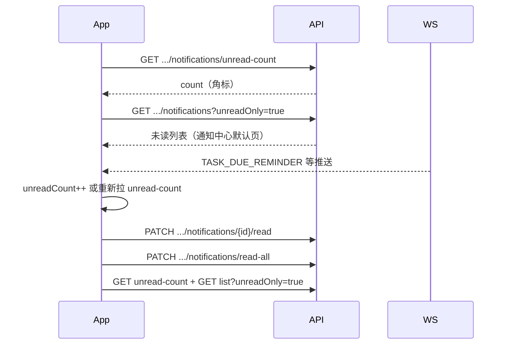

# HTTP 接口说明 — AI 对话、助手任务与站内通知（v1）

本文档描述当前后端已实现的 **AI 对话、助手任务查询、站内通知** 及 **WebSocket** 约定，与代码路径一致。  
通用鉴权、错误格式见 **`md文档/HTTP接口-认证与用户.md`** 第 1 章。

业务流程（非接口细节）见 **`md文档/AI对话与助手任务-流程说明.md`**。

**语音输入**：先 **`POST /api/v1/speech/transcribe`** 得到 `text`，再作为本章 `POST /api/v1/ai/chat` 的 `message`。见 **`md文档/HTTP接口-语音转写.md`**。

---

## 1. 通用约定

- 默认主机：`http://localhost:8000`
- URL 前缀：`/api/v1`
- 本章 REST 接口均需：`Authorization: Bearer {accessToken}`
- 用户 `status` 须为 **1（正常）**

### 1.1 业务错误码补充

| code | 典型场景 |
|------|----------|
| `FEATURE_UNAVAILABLE` | AI 提供商未配置或 MiMo 无 API Key |
| `NOT_FOUND` | 会话不存在或不属于当前用户 |
| `SPEECH_DISABLED` / `SPEECH_UNAVAILABLE` | 语音转写未开启或内网 STT 未启动 |

---

## 2. AI 对话 `/api/v1/ai`

### 2.1 发送对话消息

- **方法 / 路径**：`POST /api/v1/ai/chat`
- **说明**：用户发一轮消息，服务端完成规划（可选）、调用大模型、执行任务工具（可选），返回助手回复；**自动创建或续用会话**，并将本轮用户消息与助手最终回复落库。
- **请求体**（JSON）：

| 字段 | 类型 | 必填 | 说明 |
|------|------|------|------|
| message | string | 是 | 用户本轮输入，最长 8000 字符 |
| sessionId | number | 否 | 继续已有会话时传入；不传则新建会话 |
| provider | string | 否 | AI 提供商：`mimo`（默认）或 `ollama`；未传时使用用户在 **LLM 设置** 中的偏好 |

- **密钥来源**：由 `GET/PUT /api/v1/users/me/llm/settings` 中的 `billingMode` 决定——`PLATFORM` 走服务端配置的 Key，`BYOK` 走用户保存的 Key。详见 **`md文档/HTTP接口-认证与用户.md`** 第 3.5 节。
- **附图对话**：含图片时仍使用服务端 **VLM** 配置（`VLM_API_KEY`），与用户 BYOK 无关。

- **200 响应体**（JSON）：

| 字段 | 类型 | 说明 |
|------|------|------|
| reply | string | 助手回复正文 |
| sessionId | number | 会话 ID，下轮请求请原样带回 |
| provider | string | 实际使用的提供商 |
| model | string | 实际调用的模型名 |
| userMessageId | number | 本轮用户消息在库中的 ID |
| assistantMessageId | number | 本轮助手消息在库中的 ID |

- **示例请求**：

```json
{
  "message": "帮我记一下周五前要交周报",
  "sessionId": 12,
  "provider": "mimo"
}
```

- **示例响应**：

```json
{
  "reply": "好的，已为你创建待办「交周报」，截止日期 2026-05-23。",
  "sessionId": 12,
  "provider": "mimo",
  "model": "mimo-v2.5-pro",
  "userMessageId": 101,
  "assistantMessageId": 102
}
```

- **503 / FEATURE_UNAVAILABLE**：提供商未配置或 Key 缺失。

---

### 2.2 分页列出历史会话

- **方法 / 路径**：`GET /api/v1/ai/chat/sessions`
- **说明**：返回当前登录用户全部 AI 对话会话摘要（含 `sessionId`），按 `updatedAt` **降序**（最近活跃在前）。用于会话列表页；进入某会话后再调 **2.3** 拉消息。
- **查询参数**：

| 参数 | 类型 | 必填 | 默认 | 说明 |
|------|------|------|------|------|
| page | number | 否 | 0 | 页码，从 0 起 |
| size | number | 否 | 20 | 每页条数，范围 1～100 |

- **200 响应体**（JSON）：

| 字段 | 类型 | 说明 |
|------|------|------|
| items | array | 本页会话列表 |
| page | number | 当前页码 |
| size | number | 每页条数 |
| totalElements | number | 会话总数 |
| totalPages | number | 总页数 |
| hasNext | boolean | 是否有下一页 |

**items[] 元素**：

| 字段 | 类型 | 说明 |
|------|------|------|
| sessionId | number | 会话 ID，继续对话或拉消息时传入 |
| title | string \| null | 会话标题 |
| provider | string | 提供商，如 `mimo` |
| model | string | 模型名 |
| createdAt | string | 创建时间（ISO） |
| updatedAt | string | 最近更新时间（ISO） |

- **示例**：`GET /api/v1/ai/chat/sessions?page=0&size=20`

```json
{
  "items": [
    {
      "sessionId": 12,
      "title": "帮我记一下周五前要交周报",
      "provider": "mimo",
      "model": "mimo-v2.5-pro",
      "createdAt": "2026-05-18T10:00:00",
      "updatedAt": "2026-05-19T09:30:00"
    }
  ],
  "page": 0,
  "size": 20,
  "totalElements": 1,
  "totalPages": 1,
  "hasNext": false
}
```

- **401**：未登录。

---

### 2.3 分页拉取会话历史消息

- **方法 / 路径**：`GET /api/v1/ai/chat/sessions/{sessionId}/messages`
- **路径参数**：`sessionId` — 会话 ID（须 > 0）
- **查询参数**：

| 参数 | 类型 | 必填 | 默认 | 说明 |
|------|------|------|------|------|
| page | number | 否 | 0 | 页码，从 0 起 |
| size | number | 否 | 50 | 每页条数，范围 1～100 |

- **说明**：返回该会话下已落库的消息（仅 `USER` / `ASSISTANT`），按 `createdAt` **升序**分页；含「任务提醒」会话。长会话请翻页加载（`hasNext` 为 true 时 `page+1`）。
- **200 响应体**（JSON）：

| 字段 | 类型 | 说明 |
|------|------|------|
| sessionId | number | 会话 ID |
| sessionTitle | string \| null | 会话标题 |
| count | number | 本页消息条数 |
| messages | array | 本页消息列表 |
| page | number | 当前页码 |
| size | number | 每页条数 |
| totalElements | number | 该会话消息总数 |
| totalPages | number | 总页数 |
| hasNext | boolean | 是否有下一页 |

**messages[] 元素**：

| 字段 | 类型 | 说明 |
|------|------|------|
| id | number | 消息 ID |
| role | string | `USER` 或 `ASSISTANT` |
| content | string \| null | 文本内容 |
| imageUrls | string[] | 附图 URL（仅 USER 可能有） |
| createdAt | string | ISO 日期时间 |

- **404**：会话不存在或不属于当前用户。

---

## 3. 助手任务 `/api/v1/users/me/tasks`

助手任务与成长计划中的 `tasks` 表无关，数据来自 `user_assistant_tasks`。

### 3.1 查询当前用户的助手任务

- **方法 / 路径**：`GET /api/v1/users/me/tasks`
- **查询参数**：

| 参数 | 类型 | 必填 | 说明 |
|------|------|------|------|
| status | string | 否 | 筛选：`OPEN`、`DONE`、`CANCELLED`；不传则返回全部 |

- **200 响应体**（JSON）：

| 字段 | 类型 | 说明 |
|------|------|------|
| count | number | 条数 |
| tasks | array | 任务列表 |

**tasks[] 元素**：

| 字段 | 类型 | 说明 |
|------|------|------|
| id | number | 任务 ID |
| title | string | 标题 |
| description | string \| null | 描述 |
| status | string | `OPEN` / `DONE` / `CANCELLED` |
| dueDate | string \| null | 截止日期 `yyyy-MM-dd` |
| dueAt | string \| null | 截止时刻 `yyyy-MM-dd HH:mm`（用户本地，精确到分；无则按 `dueDate` + 默认提醒时刻） |
| imageUrls | string[] | 任务附图 URL |
| reminderSentAt | string \| null | 最近一次到期提醒发送时间 |
| createdAt | string | 创建时间 |
| updatedAt | string | 更新时间 |

> 任务的创建、更新、取消主要由 **AI 对话接口** 内模型调用后端工具完成；本接口供 App 任务列表页直接展示。**当前无**「用户直接 PATCH 标记完成」的 REST 接口，完成/取消须通过对话让 AI 调用 `update_task`，或产品侧后续单独加接口。

### 3.2 前端如何判断「任务是否已完成」（展示用）

| `status` 值 | 含义 | 列表展示建议 |
|-------------|------|----------------|
| `OPEN` | 进行中，**仍会参与到期提醒** | 默认任务页应展示；未处理会反复产生 `TASK_DUE_REMINDER` 通知 |
| `DONE` | 已完成 | 显示为已完成（勾选/置灰）；**不再发送**到期提醒 |
| `CANCELLED` | 已取消 | 显示为已取消；**不再发送**到期提醒 |

**判定规则（复制到前端）**：

```ts
const isTaskCompleted = (task) => task.status === 'DONE';
const isTaskActive = (task) => task.status === 'OPEN';
```

**推荐请求**：

- 任务页只展示待办：`GET /api/v1/users/me/tasks?status=OPEN`
- 历史/已完成：`GET /api/v1/users/me/tasks?status=DONE`（或本地分 Tab 再请求）

「喝水提醒保留很久」常见原因：对应助手任务 **`status` 仍为 `OPEN`**，定时器每分钟扫描 OPEN 任务并在到点写入新通知；与通知是否已读无关。引导用户在对话中说「喝水任务完成了」由 AI 更新为 `DONE`，或产品提供「标记完成」入口（需后端新增写接口）。

---

## 4. 站内通知 `/api/v1/users/me/notifications`

### 4.1 未读数量

- **方法 / 路径**：`GET /api/v1/users/me/notifications/unread-count`
- **200 响应体**：`{ "count": <number> }`

### 4.2 通知列表

- **方法 / 路径**：`GET /api/v1/users/me/notifications`
- **查询参数**：

| 参数 | 类型 | 默认 | 说明 |
|------|------|------|------|
| unreadOnly | boolean | `false` | `true` 时仅未读 |

- **200 响应体**（JSON）：

| 字段 | 类型 | 说明 |
|------|------|------|
| count | number | 条数 |
| items | array | 通知列表，按创建时间降序 |

**items[] 元素**：

| 字段 | 类型 | 说明 |
|------|------|------|
| id | number | 通知 ID |
| type | string | 如 `TASK_DUE_REMINDER` |
| title | string | 标题 |
| body | string | 正文摘要 |
| taskId | number \| null | 关联助手任务 ID |
| sessionId | number \| null | 关联会话 ID |
| messageId | number \| null | 关联消息 ID |
| readAt | string \| null | 已读时间；未读为 `null` |
| createdAt | string | 创建时间 |

### 4.3 标记单条已读

- **方法 / 路径**：`PATCH /api/v1/users/me/notifications/{id}/read`
- **204**：成功，无响应体。
- **404**：通知不存在。

### 4.4 全部标记已读

- **方法 / 路径**：`PATCH /api/v1/users/me/notifications/read-all`
- **204**：成功，无响应体。
- **重要**：本接口**只把未读通知写上 `readAt`，不会删除记录**。因此之后若仍调用 **4.2 列表且未传 `unreadOnly=true`**，响应里**仍会有条目**，只是每条 `readAt` 非 `null`。这与「收件箱清空」不是同一语义。

### 4.5 前端对接速查（通知中心 + 角标）

**鉴权**：所有请求带 `Authorization: Bearer {accessToken}`。

**推荐数据流**：



| 场景 | 调用 | 说明 |
|------|------|------|
| 应用启动 / 进入消息页 | `GET .../unread-count` | 角标数字 |
| 通知中心（仅未读） | `GET .../notifications?unreadOnly=true` | **一键已读后应使用此参数或本地过滤 `readAt == null`**，否则默认列表仍含已读历史 |
| 通知历史（含已读） | `GET .../notifications` 或 `unreadOnly=false` | 展示全部，用 `readAt != null` 区分样式 |
| 点开一条 | `PATCH .../notifications/{id}/read` → 204 | 本地可把该项 `readAt` 设为当前时间，并 `unreadCount--` |
| 一键已读 | `PATCH .../notifications/read-all` → 204 | 然后**必须**刷新：`unread-count` 应为 `0`；列表若只显示未读则 `unreadOnly=true` 得到 `items: []` |
| 实时 | `WebSocket /ws/v1/chat` | 见第 5 章；推送里带 `unreadCount`，可与 REST 对齐 |

**为何「一键已读后列表还有消息」**（产品/前端常见误解）：

1. **列表默认返回全部通知**（含已读），不是「未读收件箱」。
2. **已读 ≠ 删除**；记录留在库中供历史查看。
3. 正确做法：角标用 `unread-count`；未读列表用 `unreadOnly=true` 或过滤 `readAt === null`；已读项用灰色/折叠到「历史」Tab。

**示例：一键已读后拉未读列表**

```http
PATCH /api/v1/users/me/notifications/read-all
Authorization: Bearer {token}
→ 204 No Content

GET /api/v1/users/me/notifications/unread-count
→ { "count": 0 }

GET /api/v1/users/me/notifications?unreadOnly=true
→ { "count": 0, "items": [] }
```

**通知与任务联动（可选）**：`items[].taskId` 非空时，可再请求 `GET /api/v1/users/me/tasks`（或缓存任务列表），用 **3.2** 的 `status` 决定是否在通知详情里显示「任务已完成」；任务为 `DONE`/`CANCELLED` 时仍可显示该条通知正文，但不必再强调「待处理」。

### 4.6 移动系统推送（uni-push 2.0 + DCloud 托管 Firebase）— 锁屏 / 杀进程

与 **§5 WebSocket** 互补：WS 仅 **App 在线** 时有效；**uni-push 2.0** 在 **后台/杀进程** 时由系统通知栏展示（Firebase/厂商通道在 **DCloud 开发者中心** 配置，**不要**在业务后端配 Firebase JSON）。

**架构**：uni-app 客户端 → `uni.getPushClientId()` → 本后端 `PUT /push-tokens` 存 CID → 发通知时本后端 **POST uniCloud 云函数 URL** → 云函数 `uni-cloud-push.sendMessage` → 个推/托管 Firebase 下发。

#### 4.6.1 注册本机 clientId（前端）

- **方法 / 路径**：`PUT /api/v1/users/me/push-tokens`
- **说明**：登录成功、manifest 已开 uni-push 2.0、用户授权通知后调用；`token` 为 **`uni.getPushClientId()`** 返回值（非自行对接 FCM token）。
- **请求体**（JSON）：

| 字段 | 类型 | 必填 | 说明 |
|------|------|------|------|
| platform | string | 是 | `ANDROID` 或 `IOS` |
| token | string | 是 | uni-push **push_clientid**（CID），最长 512 |
| deviceId | string | 是 | 客户端稳定设备 ID（自建 UUID），最长 64 |

- **200 响应体**：`{ "deviceId": "...", "platform": "ANDROID" }`

**uni-app 示例**：

```javascript
uni.getPushClientId({
  success: (res) => {
    const cid = res.cid;
    // PUT /api/v1/users/me/push-tokens { platform, token: cid, deviceId }
  }
});
```

#### 4.6.2 注销（登出）

```http
DELETE /api/v1/users/me/push-tokens?deviceId={deviceId}
DELETE /api/v1/users/me/push-tokens
```

- **204**：成功

#### 4.6.3 服务端何时发系统推送

站内通知写入且 WS 开关允许时，若 `app.mobile-push.enabled=true` 且配置了 **`app.mobile-push.unipush-cloud-url`**（云函数 URL 化地址），后端对该用户全部 CID 调用云函数。

云函数请求体（后端自动构造，前端仅作参考）：

```json
{
  "request_id": "唯一32位内字符串",
  "cids": ["cid-1", "cid-2"],
  "title": "通知标题",
  "content": "通知正文",
  "payload": { "type": "TASK_DUE_REMINDER", "notificationId": "10", "sessionId": "2" },
  "force_notification": true,
  "settings": { "ttl": 86400000 }
}
```

**`payload`** 与 WebSocket 字段一致（`type`、`notificationId`、`sessionId`、`taskId`、`unreadCount` 等），点击通知在 `uni.onPushMessage` / 点击回调中读取。

**对话回复**：默认不发系统推送；`app.mobile-push.chat-reply-enabled=true` 时发送。

#### 4.6.4 运维必做（后端/你方）

1. DCloud 开发者中心：开通 **uni-push 2.0**，**托管配置 Firebase**（及国内厂商通道）。  
2. 部署云函数：仓库示例 `scripts/uni-push-cloud-function/index.js`，扩展库 **uni-cloud-push**，**URL 化** 得到 HTTPS 地址。  
3. `.env`：`APP_MOBILE_PUSH_ENABLED=true`、`APP_UNIPUSH_CLOUD_URL=<云函数URL>`，可选 `APP_UNIPUSH_HTTP_SECRET`。  
4. **不要**使用 `provider=fcm` 除非非 uni-app 客户端；默认 `unipush`。

详见 **`md文档/环境与密钥配置.md`** §3.5。

---

## 5. WebSocket `/ws/v1/chat`

- **地址**：`ws://localhost:8000/ws/v1/chat`（生产使用 `wss`）
- **鉴权**（握手阶段二选一）：
  - Query：`?token={accessToken}`
  - Header：`Authorization: Bearer {accessToken}`
- **说明**：连接成功后仅接收服务端推送；鉴权失败则握手失败。

### 5.1 服务端推送 JSON

**对话新回复**（`type` = `CHAT_REPLY`）：

| 字段 | 类型 | 说明 |
|------|------|------|
| type | string | 固定 `CHAT_REPLY` |
| sessionId | number | 会话 ID |
| messageId | number | 助手消息 ID |
| contentPreview | string | 正文预览（最长约 120 字） |
| unreadCount | number | 站内通知未读数 |

**任务到期提醒 / 每日 8 点摘要**（`type` = `TASK_DUE_REMINDER`）：

| 字段 | 类型 | 说明 |
|------|------|------|
| type | string | 固定 `TASK_DUE_REMINDER` |
| notificationId | number | 通知 ID |
| sessionId | number | 「任务提醒」会话 ID |
| messageId | number | 会话内消息 ID |
| taskId | number \| null | 单任务提醒时有值；每日合并摘要时为 `null` |
| title | string | 通知标题（如 `早安 · 今日待办`、周六 `早安 · 今日待办与本周回顾`） |
| body | string | 通知正文（含鼓励语、当日待办列表；周六可含【本周回顾】） |
| unreadCount | number | 站内通知未读数 |

用户本地 **每日** `app.task-reminder.default-due-date-reminder-time`（默认 `08:00`）投递一条合并消息。**当前实现不读库开关，任务提醒恒为开启**。非摘要时刻的 `due_at` 仍走单任务提醒。

**每周陪伴回顾**（`type` = `WEEKLY_COMPANION_DIGEST`）：

| 字段 | 类型 | 说明 |
|------|------|------|
| type | string | 固定 `WEEKLY_COMPANION_DIGEST` |
| notificationId | number | 通知 ID |
| sessionId | number | 「本周回顾」会话 ID |
| messageId | number | 会话内消息 ID |
| taskId | null | 本类型无任务关联 |
| title | string | 如 `本周回顾 · 2026-W20` |
| body | string | 回顾正文预览（最长约 500 字） |
| unreadCount | number | 站内通知未读数 |

推送时刻：用户本地 **周六** `app.companion-memory.digest-delivery-time`（默认 `08:00`）。**优先**并入当日 8 点任务摘要（`TASK_DUE_REMINDER`）；仅当当日摘要未成功投递时，才单独推本类型至「本周回顾」会话。需 `weekly_companion_digest=true`。

---

## 6. 配置与安全（部署备忘）

| 配置项 | 说明 |
|--------|------|
| `MIMO_API_KEY` / `app.chat.providers.mimo.api-key` | MiMo 对话 Key |
| `AI_CHAT_DEFAULT_PROVIDER` | 默认提供商 |
| `AI_CHAT_MULTI_PHASE_ENABLED` | 多阶段规划开关 |
| `AI_CHAT_PUSH_ON_REPLY` | 对话回复 WebSocket 推送 |
| `APP_TASK_REMINDER_ENABLED` | 是否执行定时提醒 |
| `APP_TASK_REMINDER_CRON` | 提醒 cron 表达式 |
| `APP_TASK_REMINDER_PUSH` | 提醒是否 WebSocket 推送 |
| `APP_COMPANION_MEMORY_ENABLED` | 是否启用每周陪伴记忆总结 |
| `APP_COMPANION_MEMORY_SUMMARIZE_CRON` | 周总结 cron（默认周六 03:00） |
| `APP_COMPANION_MEMORY_DIGEST_TIME` | 用户本地周六推送时刻（默认 08:00） |
| `APP_COMPANION_MEMORY_DIGEST_PUSH` | 本周回顾是否 WebSocket 推送 |
| `APP_MOBILE_PUSH_ENABLED` | 是否发系统推送 |
| `APP_MOBILE_PUSH_PROVIDER` | `unipush`（默认）或 `fcm` |
| `APP_UNIPUSH_CLOUD_URL` | uni-push 云函数 URL 化地址 |
| `APP_UNIPUSH_HTTP_SECRET` | 云函数 URL 安全密钥（可选） |
| `FCM_CREDENTIALS_PATH` | 仅 `provider=fcm` 时需要 |
| `APP_MOBILE_PUSH_CHAT_REPLY` | AI 回复是否也发系统推送（默认 false） |

---

## 7. 与数据脚本的关系

| 脚本 | 作用 |
|------|------|
| `scripts/mysql-ai-chat.sql` | 会话、消息、助手任务表 |
| `scripts/mysql-ai-chat-task-reminder.sql` | 任务提醒字段 |
| `scripts/mysql-in-app-notifications.sql` | 站内通知表 |
| `scripts/mysql-existing-database-changes.sql` | 含 `user_push_devices` 增量 |

---

## 8. 文档维护

接口变更时，请同步更新 **本文件**、`md文档/AI对话与助手任务-流程说明.md`、`md文档/数据库.md` 及 `docs/openapi/v1-ai-chat.yaml`。
